# Fastest Path: Bachelor Problem
<!-- TOC -->

- [Scenario](#scenario)
- [Task](#task)
- [Assumptions](#assumptions)
- [Implementation](#implementation)
- [Results](#results)
- [Build and Run](#build-and-run)
- [Model](#model)
    - [**World**](#world)
    - [**Rover Speed**](#rover-speed)
    - [**Rover Time**](#rover-time)

<!-- /TOC -->
## Scenario

A bachelor stranded on an island `(BACHELOR_X, BACHELOR_Y)`, needs to get to his wedding location `(WEDDING_X, WEDDING_Y)` using an AUDI rover `(ROVER_X, ROVER_Y)`; both located in the same island.

The island map has `2048x2048` cells, each of which have a terrain type and elevation index.

The terrain types are:
* Rivers
* Marsh land
* Water basin
* Land

The rover can only traverse on land. Additionally, every cell on land has an elevation value between `1` to `255`. The rover travels with a constant speed of `1 cell per island second`. It is faster on slopes going down and slower on positive slopes.

## Task

1. Build a rover speed model with plausible assumptions.

2. Find the fastest path from `ROVER` to `BACHELOR` to `WEDDING`.

## Assumptions

1. 1 island second = 1 second.

2. The rover can traverse any gradient on `elvevation > 0` on the island.

3. Maximum angle of slope between two adjacent cells is `45 $\degrees$`, since it's assumed the rover cannot physically climp a steeper slope without slipping.

4. The car model assumed to be the **AUDI Q5** with the following parameters:
  * Kerb weight or mass = `1850 kg`
  * Maximum power = `200 kW`
  * Top speed (at maximum power) = `200 kph` or `55.5 m/s`

## Implementation

Given that the code is required to be production grade, I decided to employ the help of one of the most highly regarded C++ libraries, the **Boost Graph Library (BGL)**. It's a header-only library, so its effects on compilation time are negligible. Plus, only the relevant dependencies are included in this repo.

The cells of the island map are modelled as nodes of a grid graph. I've removed the subset of nodes  from the grid which correspond to non-traversible cells of the map such as water and marsh lands.

A maze (grid class) member function `m_timeWeight(vertex A, vertex B, elevation)` takes in two vertices and the elevation amp, and uses equations (1), (2), (3), (4) to determine the time taken by the rover to travel from `A` to `B`. The output of the function is modelled as the weight of the edge between the two vertices `A` and `B`.

I use A-Star search with the a manhattan distance heuristic function to find the path where the rover takes the least time to get from `[ROVER_X, ROVER_Y]` to `[BACHELOR_X, BACHELOR_Y]` and then to `[WEDDING_X, WEDDING_Y]`.

## Results

```
$./Bachelor

Number of non-traversable cells: 2061148
Rover has reached the bachelor!
Time taken by rover to reach the bachelor is 57543.6 island seconds.

The bachelor has reached his wedding!
Time taken by the rover to reach the wedding from the bachelor's position is 5701.29 island seconds.

Total time taken = 63244.8 island seconds.
Or in island time, the entire trip took 17 hours 34 minutes 4 seconds.

You can open the map with $feh pic.bmp or $edisplay pic.bmp on Linux systems.

```


## Build and Run
```
$ git clone https://github.com/jimdsouza/fastestpath.git
$ cd fastestpath
$ mkdir build && cd build
$ cmake ..
$ make
$ ./Bachelor
```

## Model

### **World**

The dimension of each square cell is $side_i = c$. Let each cell have an elevation $elev_i = e_i * \alpha * c$, where $\alpha$ is a constant, and $e$ is the elevation  . 

The maximum elevation any cell can have is $elev_{max} = 255$. Since cells with $elev_i = 0$ are water and marsh lands, they cannot be traversed by the rover. So the minumum elevation for a traversible cell is $elev_{min} = 1$. It follows that the biggest elevation difference between two adjacent cells $\Delta_{max} = elev_{max} - elev_{min} = 254 \alpha c$.

According to our third assumption, the maximum angle between two traversible adjacent cells is $45 \degree$. 


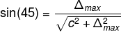

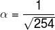


### **Rover Speed**

It's given that the speed of the rover on level ground on maximum power $P_{max}$ is $v_{flat} = 1 c/s$, or 1 cell per island second.

Since the max speed of the Audi Q5 is assumed to be `55.5 m/s` (Assumption #4) and one island second is assumed to be one real second (assumption #1), it follows,

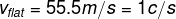

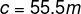


The power $P$ of its engine is used to overcome the power dissipated by the resistive force, $f$.

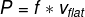

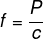


When the car, whose weight is $mg$ ($m$ = mass, $g$ = gravitational constant), is traveling up an incline, whose angle with respect to the horizontal is $\theta$, it is subject to the additional force  $f_{up}= mg \sin\theta$, which acts to impede its motion. Of course, this force is just the component of the car's weight acting down the incline. Thus, the new power balance equation is

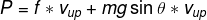


Here $v_{up}$ is the maximum velocity of the rover up the incline. It's assumed that this is constant throughout the journey up the incline of slope $\theta$.

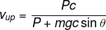


Similarly,

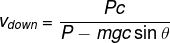


Where $v_{down}$ is the maximum constant speed down an incline of slope $\theta$.

### **Rover Time**

#### Adjacent (non-diagonal) Cells

Let time taken for the rover to travel up and down two adjacent cells be $t_{aup}$ and $t_{adn}$ respectively. Let distance be $d_{a}$

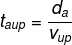

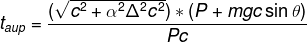


Since, 

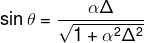


We get,

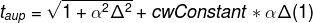


Where, $cwConstant = \frac{mgc}{P}$ is a constant. Plugging in the values of $m$, $g$, $c$, and $P$

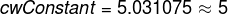


Similar to $t_{aup}$,

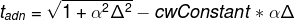


#### Diagonal Cells

Here, the diagonal travel distance on the incline becomes

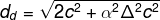


So, the time taken to travel up ($t_{dup}$) and down ($t_{ddn}$) on an incline between two diagonal cells is:

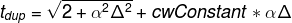


and,

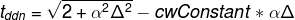


